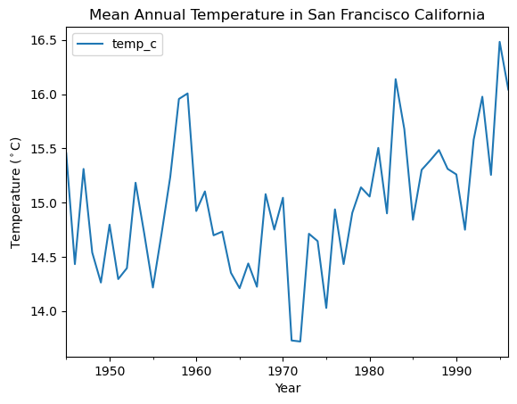
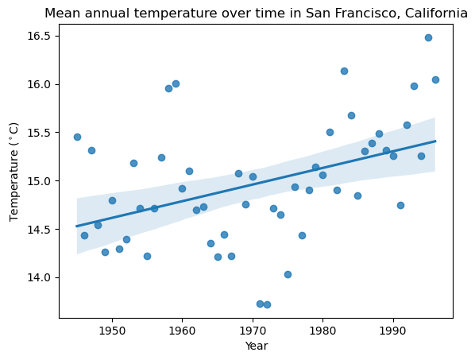

# Climate Change in the San Francisco Bay Area

## Background and Data

This project looks at temperature changes in the San Francisco Bay Area using data from the Alameda NAS weather station. The data came from NOAA. 
The dataset included daily maximum and minimum temperatures. I used those values to calculate the average daily temperature. I then converted the temperatures from Fahrenheit to Celsius and calculated the mean temperature for each year.

## Mean Annual Temperature

The mean annual temperature changes from year to year, but the overall pattern shows that temperatures became warmer over time. Some years were warmer or cooler than others, but many of the warmer years happened later in the dataset.

## Long-Term Temperature Trend

I used a linear regression to look at the long-term temperature trend.
The slope of the trend line was about **0.017 °C per year**, which is about **0.17 °C per decade**.
This means that the average annual temperature increased over the time period in the dataset. There is still a lot of year-to-year variation, but the overall trend is upward.

## Why I Used a Linear Regression

A linear regression helps show the overall direction of temperature change over time. It gives one line that represents the long-term trend.
The model does not explain every warm or cool year. Instead, it helps show the general pattern across the full dataset.

## Conclusion

Overall, the temperature data from the Alameda NAS weather station show a gradual warming trend in the San Francisco Bay Area. Average annual temperature increased by about **0.17 °C per decade** during the time period analyzed.
Even though temperatures changed from year to year, the long-term trend shows that the area became warmer over time.

## Data Source

Temperature data were downloaded from the **NOAA National Centers for Environmental Information (NCEI)**.
